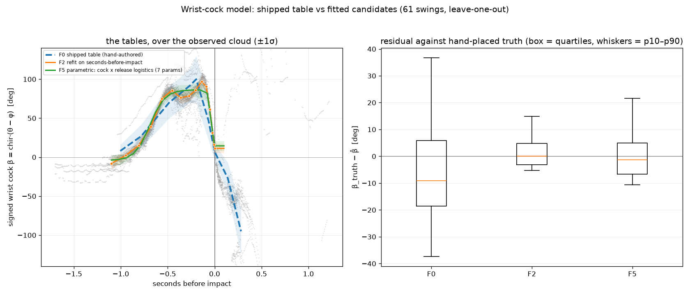

# Predicting the Club from the Arm: an Empirical Wrist-Cock Curve, and its Parametric Reading

*PinPoint shaftlab programme — model note, 2026-08-11. Fitted and graded by
`tools/swinglab/wrist_cock_fit.py` against the 61-swing production corpus and
805 hand-placed shaft labels. Implements the v2 table in
`src/Analysis/shaft_kinematics.h`, dark behind `shaft.wedge.kinModelV2`.
Companion to the programme report, `club_detection_from_video.md`, whose Phase 6
sets out the physical law this model puts numbers on.*

## 1. What this is for

The shaft tracker would like to know roughly where the club is before it looks
for it. It cannot measure θ in advance — that is the thing being solved — but it
*can* measure the lead arm from pose on every frame, including the frames where
the club is a blur. If the wrist angle between arm and club were predictable,
the arm would locate the club for free:

    θ̂(f) = φ(f) + chir · β̂(x(f))

where φ is the lead forearm direction, chir the swing's chirality, and β̂ the
signed wrist cock at some measure of swing progress x. That prediction already
exists in the tracker. It centres the blur-wedge search envelope, sets the
`kinCone` off-envelope penalty, and supplies the predicted angular rate that
triggers the wedge at all.

What it has never had is data. The table was authored by hand from the design's
expectations. This note grades it, fits a replacement, and reports what the fit
turned out to depend on — which was not what we expected.

## 2. The physical argument

Three facts about a golf swing bound the model before any fitting begins.

**The club and the lead arm are a double pendulum.** The wrist angle ψ = θ − φ
is anatomically bounded and evolves smoothly, so β̂ is a function, not a
scatter.

**The wrist cocks once and releases once.** Over address → impact the wrist
angle is monotone with a single reversal at the top; un-hinging in the backswing
or re-hinging in the downswing is anatomically impossible. This is the law the
programme report verifies on hand-marked data (Phase 6), and it means the fitted
curve should have one interior maximum, not a wiggle.

**At impact the shaft returns into line with the lead arm.** Not exactly — there
is a forward-lean term — but close enough that β near impact is small and
positive. The corpus median at impact is +11°.

The model's valid domain is therefore address → impact. Past impact the wrist
re-hinges passively under centripetal load, and the dominant motion becomes
forearm roll about the shaft's long axis, which a face-on camera cannot see at
all. Everything below is fitted and graded over address → impact only.

## 3. How it is graded

**The convention.** β = chir · wrap180(θ − φ), signed positive on the trail side
— the header's convention exactly, so a fitted table drops straight in. φ is the
lead *forearm*: the line from the lead elbow to the grip, in pixel space. Which
side leads is decided per swing from the pose, on the grip ordering over the
address hold, never from metadata.

**Anti-circularity.** A model fitted to the tracker's own θ and then used to
constrain that tracker would reinforce its errors. So fitting uses measured-tier
samples only — the tier graded at 0.6% bad against dense truth — while the
*decision* rests on 463 hand-placed shaft labels across 23 swings, which owe the
tracker nothing. Every number below is leave-one-swing-out: the held-out swing
contributes nothing to the table it is scored against.

Both are reported, because the gap between them carries information. Some of it
is circularity — the tracker-tier numbers are rosier, by roughly 20% on the
winning form. But some of it is the *distribution* of the labels rather than the
quality of the model, and §5 shows a case where reading the truth column alone
inverts a conclusion. Neither column should be read on its own.

## 4. What the shipped table was doing

| | against truth |
|---|---|
| median residual | **−9.1°** |
| p10–p90 | **74.3°** |
| \|error\| > 30° | **26.3%** |
| within 1σ of its own envelope | 62% |

It is biased and wide, and the bias alternates sign by segment (−5° in the
backswing, +12° in the downswing, −14° through), so no constant correction fixes
it. A quarter of the frames where the tracker consults the prediction are
consulting something more than 30° wrong.

## 5. The finding: the clock matters more than the numbers

Two changes are available: fit the curve to data, and change the variable it is
indexed by. Both help, and it is worth separating them, because our first
reading of this got the split badly wrong.

**The axes, measured directly.** Before fitting anything, ask how much each
candidate clock can possibly support: the spread of β about its own conditional
median on that axis, on a fine grid, leave-one-swing-out. This is the floor no
model on that axis can beat.

| axis | frame-averaged | at the instants truth labels sit |
|---|---|---|
| swing progress (bs0 / top / impact anchored) | 30.4° | **67.3°** |
| address → impact, linear | 36.8° | — |
| top → impact, linear | 25.6° | — |
| **seconds before impact** | **16.1°** | **15.4°** |

Seconds-before-impact is the better clock on both readings, and the reason is
physical: wrist release is not a fixed *fraction* of the swing but an event at a
roughly fixed *time* before impact. Two swings that reach the top at the same
fraction but take different times to get there release at the same number of
milliseconds before impact and at quite different fractions, so a progress index
smears every swing's release across every other's.

**But look at the two columns.** The progress axis is twice as bad at
truth-label instants as it is frame-averaged, and the time axis is not. Truth
labels cluster at s ≈ 0.30–0.57 — the transition region, because that is where a
human can see the shaft to label it — and `swingProgress` is anchored on the
**top**, the noisiest event in the ladder. Small top-placement errors blow β up
precisely where our labels are densest.

That distinction matters because our first pass reported the axis comparison
against truth alone and concluded that refitting on the progress axis was
"worthless" (75.6° against the hand-authored 74.3°). Both numbers sit on that
axis's truth-instant floor of 67.3°; the fit was doing as well as the axis
allows. Frame-averaged, refitting the progress axis is a large gain:

| | frame-averaged (all measured samples) | against truth |
|---|---|---|
| F0 hand-authored | 51.6° | 74.3° |
| F1 fitted, progress axis | **29.6°** | 66.9° |
| **F2 fitted, seconds before impact** | **17.4°** | **20.9°** |
| F3 + linear in φ | 14.7° | 17.4° |

*Frame-averaged over 9,463 measured-tier samples; truth over 463 hand-placed
labels across 23 swings. Both leave-one-swing-out.*

So the honest reading is: **fitting the curve is worth about 22°, and changing
the clock is worth about another 12°** — and the far larger figures a
truth-only comparison produces are partly a statement about where our labels
are, not only about the axes. This is the label-selection bias the programme
report documents, met again from the inside.

F2 improves **every session in the corpus**, not merely the average — 56→38,
59→23, 36→12, 63→16, 43→17, 37→12 (p10–p90 by session, tracker tier) — which is
what distinguishes a real effect from a fit to the corpus mean, and which does
not depend on the truth distribution at all.

Two further details mattered, and both are about representation rather than
statistics:

- **Knots have to be dense where the curve moves.** The wrist holds its lag near
  90° through most of the downswing and then releases nearly all of it in the
  last ~120 ms. Uniform knot spacing puts an 80° drop inside a single linear
  segment. Spacing knots in √(−t) — about half of them inside the last quarter
  second — is worth 2° on its own.
- **The local fit has to be quadratic.** β curves hard through the release, so a
  local *linear* fit inside any usable window carries that curvature into the
  knot value as bias, and forces the window narrow, which then starves σ of
  data. A local quadratic absorbs the curvature and lets the window stay wide:
  worth a further 5°, and it is what brought the envelope into calibration.

## 6. What did not work

**Reading the axis comparison against truth alone** — an error of ours, not of
the model. It made refitting the progress axis look worthless (75.6° against
74.3°) when frame-averaged it is a 22° gain. Both numbers were sitting on that
axis's floor *at the instants our labels occupy*, and we mistook a property of
the label distribution for a property of the axis. The lesson generalises past
this model: when a comparison is scored only where truth exists, check what the
truth distribution is doing before believing the ranking.

**Adding a linear term in φ** (F3). Genuinely more accurate on paper — 17.4°
against F2's 20.9° — but it fails on two counts. It carries a +6.5° bias against
truth while showing only +0.3° against the tracker's own tier, which is the
signature of a term fitted to tracker quirks rather than to swing mechanics. And
it is *worse than F2 on the session that supplies most of the truth labels*
(23.2° against 23.3° overall, but with the bias). Its envelope collapses to 35%
within 1σ, because the extra regressor absorbs between-swing variation in
training that it cannot predict out of sample. More accurate and less honest is
not a trade this programme makes.

**Shape constraints** (F4). Imposing the one-reversal law and the in-line-at-
impact anchor on the fitted table changed nothing material (17.9° against F3's
17.4°) and inherited F3's bias and envelope problem. The reason is the
interesting part: **the unconstrained fit already satisfies the constraints**.
The curve it recovers rises monotonically to a single maximum and releases
monotonically to a small positive value at impact, without being told to. The
physics is in the data, so asserting it adds nothing — a null result that is
mild evidence the law is real rather than imposed.

**Per-swing calibration.** Fitting a per-swing offset on the backswing, where θ
is well measured, and carrying it into the downswing *hurts*: the residual in
the last 250 ms before impact rises from 22.8° to 26.6°. A golfer's backswing
wrist offset does not predict their release. The model stays a population model,
and the per-shot auto-calibration that works for the IMU's mounting vector has
no analogue here.

## 7. The envelope, and why σ is inflated

The tracker searches an arc of centre ± kσ·σ_β, with kσ = 3. So the number that
matters is not the textbook 68%-within-1σ but whether the *true* wrist cock
falls inside the arc actually searched.

| | median half-width | true β inside |
|---|---|---|
| shipped table | 62.5° | 96.8% |
| fitted, σ as fitted | 17.7° | 90.1% |
| **fitted, σ × 2.5** | **44°** | **97.0%** |

The fitted σ is honest about this corpus and too confident about the world: at
face value the envelope would miss the true club on one frame in ten. The
shipped table covers 96.8% by being wide enough to be nearly uninformative.

The table ships at **σ × 2.5**, chosen because it is the factor at which the new
envelope covers as much true wrist cock as the old one while still searching a
narrower arc. That is the whole claim: *the search is no less forgiving than it
was, and it now points in the right place.* The inflation is not a fudge but the
explicit price of a corpus with one athlete in it — the fitted centre is a
measurement, the fitted spread is one golfer's repeatability, and only the first
of those generalises.

## 8. Is this a model, or a data set?

A fair challenge, and the honest answer is that everything above fits a **lookup
table**: fifteen knots and linear interpolation between them. That is an
empirical curve, not a model. It has as many free numbers as it has knots, none
of those numbers means anything on its own, and nothing stops it wiggling
wherever the data is thin. Calling it a model would be flattering it.

So we asked whether the curve can be written down. The physics says it has a
shape — a wrist that cocks once, holds, and releases — and two logistic
transitions express exactly that:

    β(t) = b₀ + A · Lc(t) · (1 − r · Lr(t))
    Lc(t) = logistic((t − t_c) / w_c)     the cocking
    Lr(t) = logistic((t − t_r) / w_r)     the release

Seven parameters, and every one is a quantity coaching already has a word for.
Fitted on the corpus under a robust loss, leave-one-swing-out:

| parameter | meaning | value | fold-to-fold spread |
|---|---|---|---|
| b₀ | wrist offset at address | −4.3° | ±0.5 |
| A | peak lag amplitude | 90.7° | ±0.7 |
| t_c | when the wrist cocks | −0.690 s | ±0.001 |
| w_c | how fast it cocks | 0.079 s | ±0.001 |
| **t_r** | **when the release happens** | **−0.038 s** | ±0.000 |
| **w_r** | **how fast the release is** | **0.014 s** | ±0.000 |
| r | release completeness | 0.846 | ±0.007 |

The stability is the striking part: drop any swing from the fit and the release
timing moves by less than a millisecond. This golfer releases 38 ms before
impact, over a 14 ms window, spending 85% of a 91° lag. Those are three numbers
that describe a golf swing, and they came out of a shaft detector.

**But the table is more accurate, and we ship the table.**

| | median | p10–p90 | \|err\|>30° | 3σ envelope covers |
|---|---|---|---|---|
| empirical table (15 knots) | +0.1° | **20.9°** | 6.7% | 97.0% |
| parametric (7 params) | −1.3° | 32.6° | 7.8% | 98.3% |
| shipped, hand-authored | −9.1° | 74.3° | 26.3% | 96.8% |

The parametric form is unbiased and beats the shipped table by better than two
to one, but it gives up about 12° to the lookup table. The reason is visible in
Figure 1: the real curve does not hold a flat plateau. It dips around 0.36 s
before impact and rises again to a distinct peak at 0.14 s, and a product of two
logistics cannot express that shape at all. Whether that structure is real
mechanics — a re-cock as the arm changes direction at transition — or an
artefact of one golfer's corpus is not settled by this data, and it is the first
thing a second athlete would tell us.

**One form is not a modelling exercise, and this section is not one.** The
logistic product was chosen by looking at the empirical curve and picking a
shape that resembled it. It fits because the curve is sigmoid-ish, and it would
have fitted about as well had the underlying mechanism been something else — so
it describes the shape without testing any hypothesis about the cause. No
alternative families were fitted, nothing was derived from the two-link
dynamics this note keeps invoking, and no model selection was performed. A
proper pass would derive a family from the double pendulum with a wrist torque
(where the release is largely passive once the arm decelerates, which *predicts*
a functional form rather than borrowing one), fit several families, and judge
them on out-of-domain prediction — fit the backswing, predict the release —
rather than on in-domain residual. Until that is done the seven parameters
should be read as a compact description, not as physics.

So the position is: **the shipped artefact is an empirical curve, and the
parametric fit is what it means.** The table is what the tracker evaluates,
because accuracy is what the tracker needs; the seven parameters are how the
curve is interpreted, sanity-checked, and compared between golfers, and they are
what would carry to a per-golfer model if one is ever wanted. Both are produced
by the same harness and reported together, and neither is dressed as the other.

***Figure 1.** Left: the signed wrist cock against seconds before impact.
Grey is the observed cloud — every measured-tier sample from 40 corpus swings.
The **dashed blue** curve is the shipped hand-authored table, mapped onto this
axis at the corpus-median tempo; note that it is offset through the downswing
and diverges entirely after impact. The **orange** curve with markers is the
fitted 15-knot table, the markers being the knots themselves, so the reader can
see where the curve is pinned and where it is only interpolating; the shaded
band is ±1σ as fitted. The **green** curve is the 7-parameter fit. Right:
residuals against the 463 hand-placed shaft labels, leave-one-swing-out — the
shipped table is biased low and wide, both fitted forms are centred, and the
lookup table is tighter than the parametric one.*

## 9. The table

Axis: seconds before impact, clamped to [−1.100, 0.000]. β̂ signed, trail side
positive. σ as fitted × 2.5.

| t − t_impact (s) | β̂ (°) | σ (°) | | t − t_impact (s) | β̂ (°) | σ (°) |
|---|---|---|---|---|---|---|
| −1.100 | −8.1 | 15.7 | | −0.275 | 78.4 | 16.8 |
| −0.948 | 2.2 | 13.3 | | −0.202 | 85.7 | 16.5 |
| −0.808 | 15.1 | 9.1 | | −0.140 | 96.9 | 19.1 |
| −0.679 | 38.9 | 12.3 | | −0.090 | 90.6 | 12.2 |
| −0.561 | 75.1 | 14.1 | | −0.051 | 61.2 | 13.2 |
| −0.455 | 85.6 | 12.0 | | −0.022 | 31.6 | 14.3 |
| −0.359 | 76.3 | 18.4 | | −0.006 | 16.0 | 14.4 |
| | | | | 0.000 | 11.3 | 14.9 |

Read as mechanics: the wrist is near neutral a second before impact, cocks
through the backswing to about 86° by the halfway point, *holds* between 76° and
97° for the whole of the downswing — the lag — and then releases 85° of it in
the final 140 ms, arriving 11° from in-line at impact. Nothing in the fitting
procedure asked for that shape, and §8 puts numbers on it.

## 10. Status and limitations

The table is **dark**, behind `shaft.wedge.kinModelV2`, and on the evidence
below **it stays dark**. The key-off path is byte-identical (pinned in
`shaft_kinematics_test`, and confirmed 61/61 on the corpus); the key-on path
regresses the tracker, and a more accurate model that makes the tracker worse is
not a model the tracker should use.

### The corpus A/B, and why it failed

Three runs on the studio machine, pose-pinned, 61 swings: a baseline at the code
immediately before this change, the same code with the key off, and the key on.
(The baseline had to be rebuilt rather than reusing the previous gate run,
because the microphone calibration landed in between and moves the impact anchor
on legacy acoustic captures by ~17 ms — which would have shown up as a spurious
diff attributed to this model.)

| | key off | key on | |
|---|---|---|---|
| byte-identity vs baseline | **61/61** | — | the refactor is clean |
| P5 emitted | 59/61 | 49/61 | **−10** |
| P6 emitted | 59/61 | 51/61 | **−8** |
| P8 emitted | 61/61 | 46/61 | **−15** |
| `track.valid` | 61 | 60 | −1 |
| WEDGE stamps | 581 | 360 | **−38%** |
| measured samples | 11,838 | 11,090 | −748 |
| mean coverage | 0.911 | 0.840 | **−0.071** |

**The mechanism, and it is worth understanding because it is not a bug.** The
table has two consumers with incompatible needs. As a *centre* it wants to be
accurate, and v2 is three times more accurate. But the wedge *trigger* fires on
the predicted angular rate — the time derivative of φ + chir·β — and there the
shape matters more than the value.

The hand-authored curve declines steadily from its peak all the way to the
finish, so dβ/dt contributes rate across the whole downswing. The fitted curve
holds its lag nearly flat and then dumps 85° in the last 140 ms — which is what
the wrist actually does — so it contributes almost no rate until the release and
a large spike at it. Measured on the real pose across the corpus, frames clearing
the 720°/s trigger fall from **33.9% to 23.6%**, a 30% reduction that matches the
38% drop in wedge stamps.

So the fitted table starves the trigger *by being right*. The 720°/s threshold
was calibrated against a curve that was wrong in a way that happened to help,
and correcting the curve without recalibrating the threshold trades wedge
coverage for centre accuracy. That is a bad trade on this corpus, and the gate
caught it.

**What would unblock it** — none of it attempted here, because each needs its own
gate. The trigger could read the arm's own rate rather than the prediction's,
which is what it arguably wanted all along; or `omegaMinDegS` could be
recalibrated against the v2 curve, which means re-opening a tuned constant; or
the two roles could be split, taking the centre and envelope from v2 while the
trigger keeps v1. The last is the least invasive and the most honest about what
was actually measured: the *centre* improved and the *rate* did not.

Three limits belong on the face of this note.

**One athlete.** Every number here is one golfer across five sessions and one
club type. The fitted centre may encode his release timing; the σ inflation is
what stands between that and a golfer the model has never seen. A second athlete
is the only real fix, and until there is one the honest reading is that the
*shape* of the curve is likely general and its *timing* may not be.

**The truth is thin at the ends.** The 463 labels concentrate where a human
could see the shaft, so the impact blur — the region the model most wants to
serve — is the region where truth is sparsest. The label-selection bias the
programme report documents applies here too.

**The residual is not Gaussian.** 6.7% of samples remain worse than 30° with a
p10–p90 of 20.9°, so the model is usually good and occasionally quite wrong.
Anything consuming it must treat it as a soft prior with tails, never as a
measurement — which is why it enters as an emission weight and an envelope, and
never as a veto.
